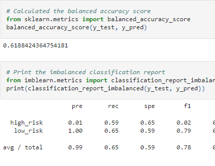

# Credit Risk Analysis
## Overview

In order to best determin credit risk here at Fast Lending, we are looking at taking many of the current machine learning algorithms to determine the best way to identify people at credit risk and ultimately deny them a loan. Since we are looking at the risk of someone being a bad debtor, we need to find a model that gives us the best recall numbers without straying too far off the precision.

## Results
The learning tests very very skewed. A lot of our data were from actual clean loans and very few true risk loans, therefore we saw a very heavy favor to the algoritm to make negative results. These screencaps of the 6 tests that we put the machine through are below in order of: Oversampled, SMOTE Sampled, Undersampled, SMOTEENN, Balanced Forest, and Easy Emsemble.

Our best score was found in the Easy Ensemble Score of an accuracy of 91.4% and F1 scores of 14% for high risk and 97% low risk. Our worst model was the undersampler that gave us an accuracy score of 51.4% and F1 scores of 1% for high risk and 64% for low risk.

## Summary
As to be expected, the more samples we are able to give a machine to model with, the better our data predicitions can be. And we find some truth with that through the two ensemble classifiers. However, with such low F1 scores for the high risk predictions, I recommend that we do not use any current machine learning algorithm until we ar ebetter able to make the F1 scores for the high risk lendees better. As of now, we are flagging too many as false positives for risk which is why we are getting such a low precision and dragging down our F1 score. While earlier, I did say we were looking for the best recall numbers, we still need to be precise in our predicitons. Due to the low amount of true high risk debtors in our data set, the machines cannot precisely tell if someone is a high risk debtor and therefore we could end up lending to too many high risk debtors.
